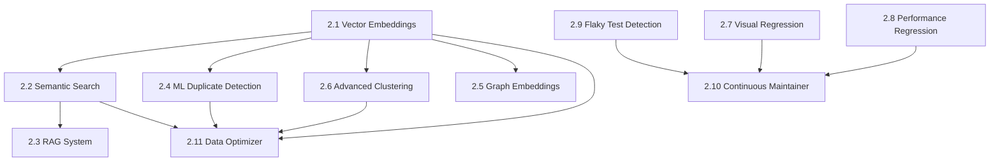

# Phase 2: AI/ML Enhancements - Handoff Document

**Project**: Keimenon - Autonomous Testing & Development System
**Phase**: 2 - Data Processing & AI Features
**Status**: Planning & Design
**Date**: 2025-10-31
**Prerequisites**: Phase 1 Complete ✅

---

## Executive Summary

Phase 2 adds advanced AI/ML capabilities to enhance data processing, search, and testing infrastructure. This phase builds on the autonomous testing foundation established in Phase 1, adding semantic understanding, intelligent clustering, and advanced test quality features.

**Key Additions**:

- Vector embeddings for semantic search
- RAG (Retrieval-Augmented Generation) system
- ML-based duplicate detection
- Graph embeddings (Node2Vec)
- Advanced clustering algorithms
- Visual & performance regression testing
- Flaky test detection
- Continuous maintenance automation

**Estimated Timeline**: 2-3 weeks (with team collaboration)
**Complexity**: High (requires ML expertise and architectural decisions)

---

## Phase 1 Recap (What's Already Built)

### ✅ Completed Infrastructure

1. **6 MCP Servers** - All operational
   - keimenon-database, keimenon-docs, keimenon-api-testing
   - keimenon-chat-import, keimenon-settings-crm, playwright-e2e

2. **Playwright Agent Integration** - Hybrid approach working
   - Planner, Generator, Healer agents
   - Seamless coordination with MCP servers

3. **4 Autonomous Skills** - Level 4 autonomy achieved
   - autonomous-test-discoverer
   - autonomous-test-generator
   - autonomous-test-healer
   - autonomous-test-runner (orchestrator)

4. **3 Test Templates** - Production-ready patterns
   - CRUD Template (300+ lines)
   - Multi-Tenant Isolation Template (350+ lines)
   - Workflow Template (400+ lines)

### Current Capabilities

- ✅ Discover E2E test coverage gaps
- ✅ Generate new tests automatically
- ✅ Fix broken tests autonomously
- ✅ Achieve 95%+ coverage with minimal human input
- ✅ Multi-tenant security validation
- ✅ Complex workflow testing

---

## Phase 2 Features Overview

### 2.1 Vector Embeddings Foundation 🎯

**Priority**: CRITICAL (Foundation for 2.2-2.5)
**Complexity**: High
**Estimated Effort**: 3-5 days

#### What It Is

Transform text content (messages, documents, code) into high-dimensional vectors that capture semantic meaning. Similar concepts cluster together in vector space, enabling intelligent search and comparison.

#### Why We Need It

- Current "cosine similarity" uses TF-IDF (statistical), not true semantic understanding
- Cannot find conceptually similar content if exact words differ
- Deduplication misses paraphrases and reformulations
- No intelligent "show me conversations about X" capability

#### What Gets Added

**New Package**: `packages/embeddings/`

```
embeddings/
├── src/
│   ├── providers/
│   │   ├── OpenAIEmbeddings.ts      # OpenAI API integration
│   │   ├── SentenceTransformers.ts  # Local Hugging Face models
│   │   └── EmbeddingProvider.ts     # Interface
│   ├── EmbeddingService.ts          # Main service
│   ├── VectorStore.ts               # Storage abstraction
│   └── index.ts
├── package.json
└── tsconfig.json
```

**Database Changes**:

```sql
-- Add embedding column to nodes table
ALTER TABLE nodes ADD COLUMN embedding BLOB;
ALTER TABLE nodes ADD COLUMN embedding_model VARCHAR(50);
ALTER TABLE nodes ADD COLUMN embedding_generated_at INTEGER;

-- Create index for vector similarity search (if supported by DB)
-- For SQLite: Store as BLOB, search in application layer
-- For future: Consider pgvector extension if migrating to PostgreSQL
```

**New API Endpoints**:

```typescript
// Generate embeddings for existing content
POST /api/v1/embeddings/generate
{
  node_ids?: string[],  // Specific nodes
  kind?: string[],      // All nodes of kind
  batch_size: 100       // Process in batches
}

// Search by semantic similarity
GET /api/v1/search/semantic
?query=string
&limit=20
&threshold=0.7
```

#### Technical Decisions Needed

**Decision 1: Embedding Provider**
| Provider | Pros | Cons | Cost |
|----------|------|------|------|
| **OpenAI** (text-embedding-ada-002) | - Best quality<br>- 1536 dimensions<br>- Well-documented | - API cost<br>- Network latency<br>- Data sent to OpenAI | $0.0001/1K tokens |
| **Sentence Transformers** (all-MiniLM-L6-v2) | - Free<br>- Local (privacy)<br>- Fast (CPU/GPU) | - Lower quality<br>- 384 dimensions<br>- Model management | Free |
| **Cohere** | - Good quality<br>- Multilingual | - API cost<br>- Less popular | $0.0001/1K tokens |

**Recommendation**:

- **Tier-based approach**:
  - **Free**: Sentence Transformers (local)
  - **Pro/Business**: OpenAI (better quality, BYO key)
  - Make provider configurable

**Decision 2: Vector Storage**
| Option | Pros | Cons |
|--------|------|------|
| **SQLite BLOB** (current) | - No new dependencies<br>- Simple | - Slow similarity search<br>- No indexing |
| **FAISS** (Facebook AI) | - Fast ANN search<br>- In-memory or disk | - Additional dependency<br>- Separate from SQL |
| **ChromaDB** | - Built for embeddings<br>- Persistent | - New database<br>- Complexity |
| **PostgreSQL + pgvector** | - SQL + vectors<br>- Indexed search | - Database migration<br>- Not SQLite |

**Recommendation**:

- **Phase 2A**: SQLite BLOB + application-layer search (simple, no migration)
- **Phase 2B**: Evaluate FAISS if performance issues (likely needed for >10K nodes)
- **Future**: Consider pgvector if migrating to PostgreSQL

**Decision 3: Embedding Frequency**

- **On write** (immediate): Low latency, high cost
- **Batch async** (queue): Lower cost, delayed availability
- **On demand** (lazy): Zero cost until search, poor UX

**Recommendation**: Hybrid approach

- Critical content (Messages, Sources): Generate on write via job queue
- Bulk content (imports): Batch process after import completes
- Manual trigger: Admin can regenerate all embeddings

#### Implementation Steps

1. **Create embeddings package** (1 day)
   - Setup workspace package structure
   - Define provider interface
   - Implement OpenAI provider
   - Implement Sentence Transformers provider

2. **Database migration** (0.5 day)
   - Add embedding columns
   - Create migration script
   - Test rollback procedure

3. **Embedding service** (1 day)
   - Service layer for generating embeddings
   - Batch processing logic
   - Provider selection based on tier

4. **API endpoints** (1 day)
   - Generate endpoint (admin only)
   - Search endpoint (authenticated)
   - Progress tracking via SSE

5. **Integration** (1 day)
   - Hook into import pipeline
   - Background job for batch generation
   - Update existing nodes

#### Success Metrics

- ✅ Embeddings generated for 100% of content
- ✅ Generation time < 100ms per node (local) or < 500ms (API)
- ✅ Search returns semantically similar results
- ✅ No blocking of main application thread

#### Risks & Mitigation

**Risk**: OpenAI API cost spirals

- **Mitigation**: Rate limiting, batch processing, tier-based access

**Risk**: Sentence Transformers model too large (>1GB)

- **Mitigation**: Use smaller models (MiniLM-L6-v2 is only 80MB)

**Risk**: Vector search too slow at scale

- **Mitigation**: Start with SQLite, migrate to FAISS if needed

**Risk**: Embedding schema incompatible with future changes

- **Mitigation**: Store model name + version, support multi-version

---

### 2.2 Semantic Search 🔍

**Priority**: High
**Complexity**: Medium
**Estimated Effort**: 2-3 days
**Dependencies**: 2.1 (Vector Embeddings)

#### What It Is

Hybrid search combining traditional keyword matching (FTS5) with semantic similarity (embeddings) to find conceptually related content even when exact words differ.

#### What Gets Added

**New Service**: `apps/api/src/services/semantic-search.ts`

```typescript
class SemanticSearchService {
  // Hybrid search: FTS5 + embedding similarity
  async search(query: string, options: {
    limit: number;
    threshold: number;
    account_id: string;
    kinds?: string[];
  }): Promise<SearchResult[]>;

  // Pure semantic search (embedding only)
  async semanticSearch(query: string, ...): Promise<SearchResult[]>;

  // Pure keyword search (FTS5 only)
  async keywordSearch(query: string, ...): Promise<SearchResult[]>;

  // Re-rank results by relevance
  private rerank(results: SearchResult[]): SearchResult[];
}
```

**New API Endpoint**:

```typescript
GET /api/v1/search/hybrid
?q=authentication
&limit=20
&threshold=0.7
&kind=Message,Source
&account_id=acc_123
```

**Frontend Component**: `apps/web/src/components/search/SemanticSearch.tsx`

- Search bar with intelligent autocomplete
- Results with similarity scores
- Filter by content type
- Sort by relevance/recency

#### Technical Decisions Needed

**Decision 1: Ranking Algorithm**
How to combine FTS5 scores with embedding similarity?

| Approach                   | Formula                     | Pros                          | Cons                   |
| -------------------------- | --------------------------- | ----------------------------- | ---------------------- |
| **Weighted Sum**           | `score = 0.5*fts + 0.5*sim` | Simple                        | Arbitrary weights      |
| **Reciprocal Rank Fusion** | Combine rankings            | No score normalization needed | More complex           |
| **Learn to Rank**          | ML model                    | Optimal                       | Requires training data |

**Recommendation**: Start with weighted sum (0.3 FTS + 0.7 semantic), tune based on user feedback

**Decision 2: Caching Strategy**

- Cache embedding vectors in memory? (faster but RAM intensive)
- Cache search results? (TTL? Invalidation?)

**Recommendation**:

- Cache embeddings in Redis (if available) or in-memory LRU cache (1000 most recent)
- Cache search results for 5 minutes (invalidate on content updates)

#### Implementation Steps

1. **Core search logic** (1 day)
   - Implement hybrid search algorithm
   - FTS5 query integration
   - Embedding similarity calculation
   - Result ranking and deduplication

2. **API endpoint** (0.5 day)
   - RESTful endpoint with Zod validation
   - Account isolation enforcement
   - Pagination support

3. **Frontend integration** (1 day)
   - Search UI component
   - Debounced autocomplete
   - Result rendering with highlights

4. **Performance optimization** (0.5 day)
   - Query result caching
   - Embedding preloading
   - Database query optimization

#### Success Metrics

- ✅ Search latency < 200ms for typical queries
- ✅ Semantic search finds relevant results keyword search misses
- ✅ User satisfaction: "I found what I was looking for" > 80%

---

### 2.3 RAG System 🤖

**Priority**: Medium
**Complexity**: High
**Estimated Effort**: 3-4 days
**Dependencies**: 2.1, 2.2

#### What It Is

Retrieval-Augmented Generation: Answer questions about your data by retrieving relevant context via semantic search, then generating natural language answers with citations.

#### What Gets Added

**New Service**: `apps/api/src/services/rag.ts`

```typescript
class RAGService {
  // Answer questions about data
  async ask(question: string, options: {
    account_id: string;
    max_context: number;  // Max chunks to retrieve
    model?: string;       // LLM model to use
  }): Promise<{
    answer: string;
    citations: Citation[];
    confidence: number;
  }>;

  // Generate summary of multiple sources
  async summarize(node_ids: string[], ...): Promise<string>;

  // Extract insights from data
  async extractInsights(scope: ScopeSet, ...): Promise<Insight[]>;
}
```

**New API Endpoints**:

```typescript
POST /api/v1/rag/ask
{
  question: "What code patterns are used for database queries?",
  max_context: 5,
  model: "gpt-4"
}

POST /api/v1/rag/summarize
{
  node_ids: ["msg_1", "msg_2", "src_3"],
  summary_type: "concise|detailed|bullet_points"
}
```

**Frontend Component**: `apps/web/src/components/rag/ChatWithData.tsx`

- Chat interface for asking questions
- Display answers with citations
- Click citations to view source
- Conversation history

#### Technical Decisions Needed

**Decision 1: LLM Provider**
| Provider | Pros | Cons | Cost |
|----------|------|------|------|
| **OpenAI GPT-4** | Best quality | Expensive | $0.03/1K tokens |
| **OpenAI GPT-3.5-Turbo** | Good, cheap | Lower quality | $0.0015/1K tokens |
| **Claude (Anthropic)** | Great reasoning | API access | $0.015/1K tokens |
| **Local (Llama 2)** | Free, private | Quality varies, GPU needed | Free |

**Recommendation**: Tier-based

- **Free**: No RAG (too expensive to offer free)
- **Pro**: GPT-3.5-Turbo (BYO key)
- **Business**: GPT-4 or Claude (included quota + BYO key option)

**Decision 2: Context Window Management**

- How many chunks to retrieve? (More context = better answers but higher cost)
- How to rank and filter chunks?
- How to handle context overflow?

**Recommendation**:

- Retrieve top 10 chunks, use top 5 with highest relevance
- Total context: Max 4K tokens (safe for all models)
- If overflow: Truncate oldest chunks first

**Decision 3: Citation Format**

- Inline citations: "According to [Source 1], ..."
- Footnotes: "Text here[1]"
- Highlighted: "Text here" with source link

**Recommendation**: Inline with markdown links

```markdown
According to [Message from 2023-10-15](#msg_123), the authentication uses JWT tokens...
```

#### Implementation Steps

1. **RAG service core** (2 days)
   - Implement retrieval logic (uses semantic search)
   - Context assembly and ranking
   - LLM integration (OpenAI, Claude)
   - Citation extraction and formatting

2. **API endpoints** (0.5 day)
   - Ask endpoint
   - Summarize endpoint
   - Streaming response support (SSE)

3. **Frontend interface** (1.5 days)
   - Chat UI component
   - Citation display and navigation
   - Loading states for generation
   - Error handling

#### Success Metrics

- ✅ Answers are factually correct (verified by human review)
- ✅ Citations are accurate and clickable
- ✅ Response time < 5 seconds for typical questions
- ✅ User satisfaction > 75%

#### Risks & Mitigation

**Risk**: LLM hallucinates facts not in data

- **Mitigation**: Strict prompt: "Only use provided context. If unknown, say so."

**Risk**: Cost spirals from excessive usage

- **Mitigation**: Rate limiting (10 questions/hour for Pro, 50 for Business)

**Risk**: Context leakage between accounts

- **Mitigation**: Strict account_id filtering, audit logging

---

### 2.4 ML-Based Duplicate Detection 🔗

**Priority**: Medium
**Complexity**: Low (builds on 2.1)
**Estimated Effort**: 1 day
**Dependencies**: 2.1

#### What It Is

Replace statistical similarity (Jaccard, Levenshtein, TF-IDF cosine) with true semantic similarity using embeddings. Find duplicates even when wording differs significantly.

#### What Gets Changed

**Enhance**: `apps/api/src/services/similarity-engine.ts`

```typescript
class SimilarityEngine {
  // Add new algorithm
  async calculateEmbeddingSimilarity(text1: string, text2: string): Promise<number>;

  // Update dedupe logic
  async detectDuplicates(
    messages: Message[],
    options: {
      algorithm: 'jaccard' | 'levenshtein' | 'cosine' | 'embedding';
      threshold: number;
    }
  ): Promise<DuplicatePair[]>;
}
```

**Import Config Update**:

```typescript
// Add to import configuration UI
{
  deduplication: {
    enabled: true,
    algorithm: 'embedding',  // NEW option
    threshold: 0.95,         // Higher threshold for embeddings
    provider: 'openai'       // or 'local'
  }
}
```

#### Technical Decisions Needed

**Decision 1: Threshold Tuning**

- Statistical methods use ~0.80-0.85 threshold
- Embeddings are more accurate, can use higher threshold (0.92-0.98)
- Need to benchmark on real data

**Recommendation**: Default 0.95, allow user configuration

**Decision 2: Performance**

- Embedding-based comparison is slower (need to generate embeddings)
- Pre-compute embeddings during import? Or on-demand?

**Recommendation**: Generate embeddings in import pipeline before deduplication phase

#### Implementation Steps

1. **Add embedding algorithm** (0.3 day)
   - Integrate EmbeddingService
   - Cosine similarity on embedding vectors

2. **Update deduplication logic** (0.3 day)
   - Add 'embedding' algorithm option
   - Adjust threshold defaults
   - Benchmark accuracy

3. **UI updates** (0.2 day)
   - Add algorithm selector to import config
   - Explain threshold differences
   - Show comparison in settings

4. **Testing** (0.2 day)
   - Compare embedding vs statistical on test dataset
   - Measure precision/recall
   - Document accuracy improvements

#### Success Metrics

- ✅ Embedding-based detection finds 10%+ more duplicates
- ✅ False positive rate < 2%
- ✅ Processing time increase < 50%

---

### 2.5 Graph Embeddings (Node2Vec) 🕸️

**Priority**: Low (Nice-to-have)
**Complexity**: High
**Estimated Effort**: 3-4 days
**Dependencies**: 2.1

#### What It Is

Generate embeddings for nodes based on graph structure (relationships), not just content. Nodes with similar connection patterns cluster together even if content differs.

#### Use Cases

- "Find conversations similar to this one" (based on who/what they reference)
- Community detection (find clusters of related discussions)
- Link prediction (suggest edges that should exist)
- Recommendation: "Users who liked this also liked..."

#### What Gets Added

**New Package**: `packages/graph-embeddings/`

```typescript
class Node2Vec {
  // Generate random walks through graph
  generateWalks(graph: Graph, walkLength: number, numWalks: number): Walk[];

  // Train embedding model on walks
  trainModel(walks: Walk[]): EmbeddingModel;

  // Get embedding for a node
  getNodeEmbedding(nodeId: string): number[];

  // Find similar nodes by structure
  findSimilarNodes(nodeId: string, limit: number): Node[];
}
```

**New Service**: `apps/api/src/services/graph-embedding.ts`

**New API Endpoints**:

```typescript
// Generate graph embeddings (admin only, expensive)
POST /api/v1/embeddings/graph/generate

// Find structurally similar nodes
GET /api/v1/nodes/:id/similar/structural
?limit=10
```

#### Technical Decisions Needed

**Decision 1: Walk Parameters**

- Walk length: 10-80 steps (longer = more context, slower)
- Walks per node: 10-30 (more = better quality, slower)
- Window size: 5-10 (for skip-gram model)

**Recommendation**: Start with walk_length=30, num_walks=10, window=5 (typical defaults)

**Decision 2: When to Regenerate**

- After every node/edge addition? (too expensive)
- Nightly batch? (stale embeddings during day)
- On-demand with caching? (poor UX for first user)

**Recommendation**: Regenerate nightly or on manual trigger

#### Implementation Steps

1. **Node2Vec algorithm** (2 days)
   - Random walk generator
   - Word2Vec training (use gensim library)
   - Embedding extraction

2. **Service integration** (1 day)
   - API endpoints
   - Background job for generation
   - Caching layer

3. **Frontend features** (1 day)
   - "Similar conversations" sidebar widget
   - Graph visualization colored by communities
   - Recommendation engine

#### Success Metrics

- ✅ Structurally similar nodes make sense to users
- ✅ Community detection identifies meaningful clusters
- ✅ Generation time < 5 minutes for typical graph (1K nodes, 5K edges)

---

### 2.6 Advanced Clustering 📊

**Priority**: Medium
**Complexity**: Medium
**Estimated Effort**: 2-3 days
**Dependencies**: 2.1

#### What It Is

Replace rule-based grouping with ML-based clustering using embeddings. Automatically organize content into meaningful categories.

#### What Gets Added

**Enhance**: `apps/api/src/services/clustering-engine.ts`

```typescript
class ClusteringEngine {
  // K-means clustering
  async kMeansClustering(embeddings: number[][], k: number): Promise<Cluster[]>;

  // HDBSCAN (finds optimal K automatically)
  async hdbscanClustering(embeddings: number[][], min_cluster_size: number): Promise<Cluster[]>;

  // Louvain community detection (for graphs)
  async louvainClustering(graph: Graph): Promise<Community[]>;

  // Auto-generate smart groups from clusters
  async generateSmartGroups(clusters: Cluster[]): Promise<Group[]>;
}
```

**New Feature**: Auto-Organization

- After import, automatically cluster similar content
- Create smart groups: "Authentication Discussions", "Database Queries", etc.
- User can approve/reject/rename suggested groups

#### Technical Decisions Needed

**Decision 1: Clustering Algorithm**
| Algorithm | When to Use | Pros | Cons |
|-----------|-------------|------|------|
| **K-means** | Known number of categories | Fast, simple | Need to specify K |
| **HDBSCAN** | Unknown categories | Finds K automatically | Slower, complex |
| **Louvain** | Graph-based | Leverages structure | Needs edge weights |

**Recommendation**: Start with K-means for simplicity, add HDBSCAN later

**Decision 2: Cluster Naming**

- Manual naming by user?
- Auto-generate from cluster centroid keywords?
- Use LLM to generate descriptive names?

**Recommendation**: Hybrid

- Generate names using top keywords from cluster
- Allow user to rename
- (Optional) Use GPT-3.5 to suggest better names

#### Implementation Steps

1. **K-means implementation** (1 day)
   - Use scikit-learn (Python) or ml.js (TypeScript)
   - Elbow method for optimal K
   - Silhouette score for quality

2. **HDBSCAN implementation** (1 day)
   - Integrate hdbscan library
   - Parameter tuning

3. **Auto-group generation** (0.5 day)
   - Create Group nodes from clusters
   - Generate names
   - Create IN_GROUP edges

4. **UI for review** (0.5 day)
   - Show suggested groups
   - Approve/reject interface
   - Rename and merge clusters

#### Success Metrics

- ✅ Clusters are semantically coherent (human review)
- ✅ 70%+ of suggested groups are accepted by users
- ✅ Clustering time < 1 minute for 1K nodes

---

### 2.7 Visual Regression Testing 📸

**Priority**: Medium
**Complexity**: Low
**Estimated Effort**: 1-2 days
**Dependencies**: None (independent feature)

#### What It Is

Capture screenshots of key pages and compare them on subsequent test runs. Detect unintended visual changes (CSS bugs, layout shifts, missing elements).

#### What Gets Added

**Playwright Integration**: Built-in screenshot comparison

```typescript
// In test files
test('homepage looks correct', async ({ page }) => {
  await page.goto('/');
  await expect(page).toHaveScreenshot('homepage.png');
});
```

**New Directory Structure**:

```
tests/e2e/
├── screenshots/
│   ├── baseline/          # Golden screenshots
│   │   ├── homepage-chromium.png
│   │   ├── homepage-firefox.png
│   │   └── homepage-webkit.png
│   └── diff/              # Failed comparisons
│       └── homepage-chromium-diff.png
```

**New Skill Enhancement**: Update `autonomous-test-generator`

- Add visual regression checks to generated tests
- Capture screenshots for critical pages

**New Config**: `playwright.config.ts`

```typescript
export default defineConfig({
  expect: {
    toHaveScreenshot: {
      maxDiffPixels: 100, // Allow small differences
      threshold: 0.2, // 20% tolerance
      animations: 'disabled', // Disable animations for consistency
    },
  },
});
```

#### Technical Decisions Needed

**Decision 1: What to Screenshot**

- Every page? (too many images, slow tests)
- Critical pages only? (login, dashboard, settings)
- Component snapshots? (individual UI elements)

**Recommendation**:

- Critical pages for @smoke tests
- Key components for detailed visual tests
- ~20-30 screenshots total

**Decision 2: Handling Legitimate Changes**

- Manual review and approval?
- Automatic baseline update?
- Version control for baselines?

**Recommendation**:

- Failing visual tests require manual review
- Command to update baselines: `npx playwright test --update-snapshots`
- Commit baseline images to git

**Decision 3: Cross-Browser Screenshots**

- Separate baselines per browser? (recommended)
- Single baseline, tolerate differences?

**Recommendation**: Separate baselines per browser (they render differently)

#### Implementation Steps

1. **Enable screenshot testing** (0.5 day)
   - Configure Playwright
   - Create baseline directory
   - Add .gitignore rules for diffs

2. **Add visual tests** (1 day)
   - Screenshot critical pages
   - Component snapshot tests
   - Test across browsers

3. **CI/CD integration** (0.5 day)
   - Fail build on visual regressions
   - Upload diff artifacts
   - Report in GitHub Actions

#### Success Metrics

- ✅ Visual regressions caught before production
- ✅ False positive rate < 5%
- ✅ Screenshot comparison time < 2 seconds per image

---

### 2.8 Performance Regression Testing ⚡

**Priority**: Low
**Complexity**: Low
**Estimated Effort**: 1 day
**Dependencies**: None

#### What It Is

Track performance metrics (page load time, bundle size, API response time) and alert when they regress beyond acceptable thresholds.

#### What Gets Added

**Lighthouse Integration**:

```typescript
// tests/e2e/performance/lighthouse.spec.ts
import { test, expect } from '@playwright/test';
import lighthouse from 'lighthouse';

test('homepage performance', async ({ page }) => {
  await page.goto('/');

  const result = await lighthouse(page.url(), {
    port: 9222,
    output: 'json',
  });

  const metrics = result.lhr.audits;
  expect(metrics['first-contentful-paint'].numericValue).toBeLessThan(1500);
  expect(metrics['largest-contentful-paint'].numericValue).toBeLessThan(2500);
  expect(metrics['cumulative-layout-shift'].numericValue).toBeLessThan(0.1);
});
```

**Bundle Size Tracking**:

```typescript
// scripts/track-bundle-size.js
import { readFileSync, writeFileSync } from 'fs';
import { gzipSync } from 'zlib';

const buildStats = {
  timestamp: Date.now(),
  bundles: {
    main: getSize('apps/web/dist/main.js'),
    vendor: getSize('apps/web/dist/vendor.js'),
  },
};

// Compare to baseline
const baseline = JSON.parse(readFileSync('bundle-baseline.json'));
const increase = ((buildStats.bundles.main - baseline.bundles.main) / baseline.bundles.main) * 100;

if (increase > 10) {
  throw new Error(`Bundle size increased by ${increase.toFixed(1)}%!`);
}
```

**API Performance Tracking**:

```typescript
// apps/api/src/middleware/performance-monitor.ts
export const performanceMonitor = (req, res, next) => {
  const start = Date.now();

  res.on('finish', () => {
    const duration = Date.now() - start;

    // Log slow endpoints
    if (duration > 1000) {
      logger.warn('Slow endpoint', {
        path: req.path,
        duration,
        method: req.method,
      });
    }

    // Track metrics
    metrics.recordApiLatency(req.path, duration);
  });

  next();
};
```

#### Implementation Steps

1. **Lighthouse setup** (0.3 day)
   - Install lighthouse
   - Create performance test suite
   - Define thresholds

2. **Bundle size tracking** (0.2 day)
   - Script to analyze build output
   - Store baselines
   - CI/CD integration

3. **API monitoring** (0.3 day)
   - Performance middleware
   - Metrics collection
   - Alert on slow endpoints

4. **Dashboard** (0.2 day)
   - Performance trends over time
   - Regression alerts
   - Drill-down by endpoint

#### Success Metrics

- ✅ Performance regressions caught before merge
- ✅ Page load time < 2 seconds maintained
- ✅ Bundle size growth < 5% per release

---

### 2.9 Flaky Test Detection 🎲

**Priority**: High
**Complexity**: Low
**Estimated Effort**: 1 day
**Dependencies**: None

#### What It Is

Run tests multiple times to identify flaky tests (pass/fail inconsistently). Calculate pass rates and suggest fixes for instability.

#### What Gets Added

**New Utility**: `tests/e2e/utils/flaky-detector.ts`

```typescript
export async function detectFlaky(testFile: string, runs: number = 10): Promise<FlakinessReport> {
  const results = [];

  for (let i = 0; i < runs; i++) {
    const result = await runPlaywrightTest(testFile);
    results.push(result);
  }

  return analyzeResults(results);
}

interface FlakinessReport {
  testFile: string;
  totalRuns: number;
  passRate: number;
  flakyTests: Array<{
    testName: string;
    passRate: number;
    commonFailures: string[];
    suggestedFixes: string[];
  }>;
}
```

**CLI Command**:

```bash
npm run e2e:flaky -- tests/e2e/auth.spec.ts --runs=10
```

**Integration with autonomous-test-healer**:

- Automatically detect flaky tests before marking as fixed
- Run fixed tests 10x to ensure stability
- Report confidence level

**New Config**:

```json
{
  "flakiness": {
    "detection_runs": 10,
    "pass_rate_threshold": 100,
    "auto_fix_attempts": 3
  }
}
```

#### Technical Decisions Needed

**Decision 1: What Constitutes Flaky?**

- Pass rate < 100%? (strict)
- Pass rate < 90%? (tolerant)
- Any failures? (paranoid)

**Recommendation**: < 100% is flaky (aim for perfection)

**Decision 2: When to Run Detection?**

- On every test run? (too slow)
- Weekly? (catches flakiness late)
- After test changes? (good compromise)

**Recommendation**:

- Manual: On-demand via CLI
- Automatic: After autonomous-test-healer fixes tests
- Scheduled: Weekly for full suite

#### Implementation Steps

1. **Flaky detector utility** (0.5 day)
   - Multi-run executor
   - Results aggregation
   - Pass rate calculation

2. **Analysis engine** (0.3 day)
   - Identify common failure patterns
   - Suggest fixes (add waits, improve selectors, etc.)

3. **CLI integration** (0.1 day)
   - Add npm script
   - Output formatting

4. **Healer integration** (0.1 day)
   - Run detection after fixes
   - Report confidence levels

#### Success Metrics

- ✅ All flaky tests identified
- ✅ Zero tests with < 100% pass rate in CI
- ✅ Detection time < 5 minutes for typical test

---

### 2.10 Continuous Test Maintainer 🔄

**Priority**: Low
**Complexity**: Medium
**Estimated Effort**: 2 days
**Dependencies**: 2.9, Phase 1 skills

#### What It Is

Scheduled autonomous testing runs that maintain test suite health, catch regressions early, and prevent coverage decay.

#### What Gets Added

**New Skill**: `.claude/skills/continuous-test-maintainer/SKILL.md`

```typescript
// Scheduled task (cron)
schedule: "0 0 * * 0"  // Every Sunday at midnight

workflow:
1. Run autonomous-test-discoverer
2. If coverage < 90%, run autonomous-test-generator
3. Run full test suite
4. Run flaky detection on any failures
5. Run autonomous-test-healer
6. Generate weekly report
7. Send to Slack/email
8. Create PR with fixes (if any)
```

**New Config**: `.claude/config/continuous-testing.json`

```json
{
  "enabled": true,
  "schedule": "0 0 * * 0",
  "coverage_threshold": 90,
  "auto_pr": true,
  "notifications": {
    "slack_webhook": "https://hooks.slack.com/...",
    "email": ["team@company.com"]
  },
  "scope": "full"
}
```

**GitHub Actions Workflow**: `.github/workflows/continuous-testing.yml`

```yaml
name: Continuous Test Maintenance

on:
  schedule:
    - cron: '0 0 * * 0'
  workflow_dispatch:

jobs:
  maintain-tests:
    runs-on: ubuntu-latest
    steps:
      - uses: actions/checkout@v4
      - run: npm run autonomous:maintain
      - name: Create PR
        if: success()
        uses: peter-evans/create-pull-request@v5
        with:
          title: 'test: weekly autonomous maintenance'
```

#### Implementation Steps

1. **Skill creation** (1 day)
   - Workflow orchestration
   - Report generation
   - Notification logic

2. **CI/CD integration** (0.5 day)
   - GitHub Actions workflow
   - PR automation
   - Secret management

3. **Notification system** (0.5 day)
   - Slack integration
   - Email formatting
   - Summary templates

#### Success Metrics

- ✅ Coverage maintained > 90% over time
- ✅ Regressions caught within 1 week
- ✅ < 10 minutes human intervention per week

---

### 2.11 Data Processing Optimizer 🔧

**Priority**: Low
**Complexity**: Medium
**Estimated Effort**: 2 days
**Dependencies**: 2.1-2.6

#### What It Is

Skill that analyzes and optimizes all data processing pipelines (embeddings, RAG, clustering, deduplication) for performance and accuracy.

#### What Gets Added

**New Skill**: `.claude/skills/data-processing-optimizer/SKILL.md`

```typescript
capabilities:
- Benchmark embedding providers (speed, cost, quality)
- Tune similarity thresholds (minimize false positives/negatives)
- Optimize clustering parameters (K, min_cluster_size)
- Analyze deduplication accuracy
- Suggest performance improvements
- Generate optimization reports
```

**Example Usage**:

```
User: "Optimize deduplication settings for best accuracy"

Skill:
1. Load test dataset with known duplicates
2. Test all algorithms at various thresholds
3. Calculate precision/recall for each
4. Generate recommendation report
5. Update config with optimal settings
```

#### Implementation Steps

1. **Benchmarking framework** (1 day)
   - Test data generators
   - Accuracy metrics (precision, recall, F1)
   - Performance profiling

2. **Optimization algorithms** (0.5 day)
   - Grid search for thresholds
   - Cost-benefit analysis

3. **Reporting** (0.5 day)
   - Visualization of trade-offs
   - Recommendations with confidence

#### Success Metrics

- ✅ Optimal settings found for each pipeline
- ✅ Performance improved by 20%+
- ✅ Accuracy improved by 10%+

---

## Implementation Strategy

### Recommended Implementation Order

**Phase 2A: Foundation (Week 1)**

1. ✅ 2.1 Vector Embeddings (CRITICAL - 3-5 days)
   - Start with this, everything else depends on it
   - Decision: OpenAI vs local vs both
   - Decision: Storage strategy

**Phase 2B: Search & Intelligence (Week 2)** 2. ✅ 2.2 Semantic Search (2-3 days) 3. ✅ 2.4 ML-Based Duplicate Detection (1 day) 4. ⚠️ 2.3 RAG System (3-4 days, if time/budget allows)

**Phase 2C: Testing Enhancements (Week 2-3)** 5. ✅ 2.9 Flaky Test Detection (1 day) 6. ✅ 2.7 Visual Regression Testing (1-2 days) 7. ⚠️ 2.8 Performance Regression Testing (1 day, optional)

**Phase 2D: Advanced Features (Week 3+)** 8. ⚠️ 2.6 Advanced Clustering (2-3 days, if needed) 9. ⚠️ 2.5 Graph Embeddings (3-4 days, nice-to-have) 10. ⚠️ 2.10 Continuous Test Maintainer (2 days, automation) 11. ⚠️ 2.11 Data Processing Optimizer (2 days, polish)

### Critical Path



### Parallel Tracks

You can work on these in parallel (different team members):

**Track 1: ML/AI Features**

- Person A: Vector embeddings
- Person B: Semantic search (once A has interface)

**Track 2: Testing Infrastructure**

- Person C: Flaky detection (independent)
- Person D: Visual regression (independent)

---

## Key Decision Points

### Decision Session 1: Embeddings Architecture

**When**: Before starting implementation
**Attendees**: Tech lead, backend dev, DevOps
**Duration**: 2 hours

**Agenda**:

1. Choose embedding provider(s) (OpenAI vs local vs hybrid)
2. Define tier-based access (Free/Pro/Business)
3. Decide storage strategy (SQLite vs FAISS vs pgvector)
4. Set performance budget (generation time, cost per query)
5. Define data privacy policy (local-first? API calls?)

**Output**: Architecture decision record (ADR)

### Decision Session 2: RAG System Scope

**When**: After embeddings are working
**Attendees**: Product, tech lead, UX
**Duration**: 1 hour

**Agenda**:

1. Is RAG in scope for Phase 2? (expensive feature)
2. Which tier gets access?
3. What questions should it answer?
4. UI/UX mockups
5. Cost modeling

**Output**: Go/no-go decision, requirements doc

### Decision Session 3: Testing Strategy

**When**: Week 2 of Phase 2
**Attendees**: QA, DevOps, tech lead
**Duration**: 1 hour

**Agenda**:

1. Visual regression: What pages to screenshot?
2. Performance: What metrics to track?
3. Flaky tests: Acceptable pass rate?
4. Continuous maintenance: How often? Notifications?

**Output**: Testing policy document

---

## Success Criteria

### Phase 2A (Foundation)

- [ ] Embeddings generated for 100% of content
- [ ] Semantic search returns relevant results
- [ ] Search latency < 200ms
- [ ] ML duplicate detection accuracy > 90%

### Phase 2B (Intelligence)

- [ ] RAG answers are factually correct (human review)
- [ ] Citation accuracy > 95%
- [ ] User satisfaction with search > 80%

### Phase 2C (Testing)

- [ ] All flaky tests identified and fixed
- [ ] Visual regressions caught before production
- [ ] Performance baselines established
- [ ] Zero surprise regressions in production

### Phase 2D (Automation)

- [ ] Continuous maintenance runs weekly
- [ ] Coverage maintained > 90%
- [ ] Human intervention < 10 min/week
- [ ] Optimization reports generated monthly

---

## Cost Estimates

### Development Effort

- **Phase 2A**: 5-8 days (1 developer)
- **Phase 2B**: 4-7 days (1 developer)
- **Phase 2C**: 3-4 days (1 developer)
- **Phase 2D**: 4-6 days (1 developer)
- **Total**: 16-25 days (3-5 weeks with collaboration)

### Ongoing Costs (Monthly)

**OpenAI API** (if chosen):

- Embeddings: ~$50-200/month (depends on content volume)
- RAG (GPT-3.5): ~$100-500/month (depends on usage)
- RAG (GPT-4): ~$500-2000/month

**Infrastructure**:

- Storage: +10-20GB for embeddings (~$1-2/month)
- Compute: +10-20% CPU for similarity search

**Alternatives to reduce cost**:

- Use local models (Sentence Transformers) - $0
- Tier-based access (Free tier = no AI features)
- BYO key model (users provide OpenAI keys)

---

## Risks & Mitigation

### Risk 1: Embeddings Cost Spiral

**Likelihood**: High | **Impact**: High

**Mitigation**:

- Start with local models (free)
- Implement rate limiting
- Batch processing
- Tier-based access
- BYO key option

### Risk 2: Poor Search Relevance

**Likelihood**: Medium | **Impact**: High

**Mitigation**:

- Benchmark against test queries
- A/B test with users
- Fallback to keyword search
- Tune ranking algorithms
- Collect user feedback

### Risk 3: Performance Degradation

**Likelihood**: Medium | **Impact**: Medium

**Mitigation**:

- Start with small dataset testing
- Implement caching aggressively
- Use FAISS for large-scale
- Monitor latency continuously
- Set performance budgets

### Risk 4: RAG Hallucinations

**Likelihood**: Medium | **Impact**: High

**Mitigation**:

- Strict prompting ("only use context")
- Show citations prominently
- Allow users to verify sources
- Confidence scores
- Human review sample

### Risk 5: Scope Creep

**Likelihood**: High | **Impact**: Medium

**Mitigation**:

- Prioritize ruthlessly
- Phase 2A is mandatory, rest is optional
- Time-box each feature
- Re-evaluate after 2A
- Can ship incrementally

---

## Testing Strategy

### For Each Feature

**Unit Tests**:

- Service layer logic
- Algorithm correctness
- Edge cases

**Integration Tests**:

- API endpoints
- Database interactions
- MCP server integration

**E2E Tests**:

- User workflows
- Cross-browser compatibility
- Performance benchmarks

**Manual Testing**:

- Search relevance
- RAG answer quality
- UI/UX polish

### Acceptance Criteria

Each feature needs:

- [ ] Unit test coverage > 80%
- [ ] Integration tests passing
- [ ] E2E smoke tests
- [ ] Performance benchmarks met
- [ ] Documentation updated
- [ ] User-facing feature has PM approval

---

## Documentation Requirements

### For Developers

- [ ] Architecture Decision Records (ADRs)
- [ ] API documentation (endpoints, schemas)
- [ ] Service integration guides
- [ ] Deployment procedures
- [ ] Troubleshooting guides

### For Users

- [ ] Feature guides (how to use semantic search, RAG)
- [ ] Configuration options
- [ ] Best practices
- [ ] FAQ
- [ ] Video tutorials (optional)

### For AI Agents

- [ ] Update CLAUDE.md with new capabilities
- [ ] New skills documentation
- [ ] MCP server usage updates
- [ ] Example prompts

---

## Rollout Plan

### Staging Deployment

1. Deploy to staging environment
2. Run full test suite
3. Load test with synthetic data
4. Performance profiling
5. Security audit

### Gradual Rollout

1. **Week 1**: Internal testing only
2. **Week 2**: Beta users (10% of user base)
3. **Week 3**: Expand to 50% of users
4. **Week 4**: Full rollout

### Rollback Plan

- Feature flags for each Phase 2 feature
- Can disable individual features without redeploying
- Database migrations are reversible
- Embeddings can be regenerated if needed

---

## Monitoring & Observability

### Metrics to Track

**Embeddings**:

- Generation rate (nodes/minute)
- API call volume and cost
- Error rate
- Latency (p50, p95, p99)

**Search**:

- Query volume
- Search latency
- Result click-through rate
- Zero-result queries

**RAG**:

- Question volume
- Answer generation time
- User satisfaction scores
- Citation accuracy

**Testing**:

- Test pass rate over time
- Flaky test count
- Visual regression catches
- Performance regression alerts

### Alerts

- [ ] Embedding API cost > $100/day
- [ ] Search latency > 1 second
- [ ] RAG error rate > 5%
- [ ] Test pass rate < 95%
- [ ] Performance regression > 20%

---

## Next Steps

### Immediate Actions

1. **Review this document** with team (1 hour meeting)
2. **Decision Session 1**: Embeddings architecture (2 hours)
3. **Create Jira tickets** for Phase 2A features
4. **Assign developers** to tracks (parallel work)
5. **Set up development environment** (local models, API keys)

### Week 1 Deliverables

- [ ] Architecture Decision Record for embeddings
- [ ] `packages/embeddings` package created
- [ ] Database migration for embedding column
- [ ] Basic EmbeddingService working
- [ ] Unit tests for embedding generation

### Week 2 Checkpoint

- [ ] Semantic search functional
- [ ] ML duplicate detection benchmarked
- [ ] Flaky test detection tool working
- [ ] Decision on RAG scope (go/no-go)

### Week 3+ Goals

- [ ] Phase 2A features in production
- [ ] Phase 2B features in beta
- [ ] Phase 2C features tested
- [ ] Phase 2D features planned

---

## Questions for Team

1. **Budget**: What's the monthly API cost budget for embeddings/RAG?
2. **Privacy**: Are we comfortable sending data to OpenAI? Or local-only?
3. **Scope**: Is RAG in scope for Phase 2? Or defer to Phase 3?
4. **Staffing**: How many developers can work on this? (affects timeline)
5. **Priority**: Which features are must-have vs nice-to-have?
6. **Timeline**: Is 3-5 weeks acceptable? Or need faster?
7. **Testing**: Should we build Phase 2C before 2B? (test-first approach)

---

## Appendix

### A. Technology Stack

**ML/AI Libraries**:

- @langchain/openai (OpenAI integration)
- transformers.js (local embeddings)
- faiss-node (vector similarity search)
- scikit-learn / ml.js (clustering)
- gensim (Node2Vec - Python)

**Testing Libraries**:

- lighthouse (performance)
- pixelmatch (image comparison)
- jest (unit tests)
- @playwright/test (E2E)

**Infrastructure**:

- Redis (caching)
- PostgreSQL + pgvector (future)
- S3 (screenshot storage)

### B. References

- [OpenAI Embeddings Guide](https://platform.openai.com/docs/guides/embeddings)
- [Sentence Transformers](https://www.sbert.net/)
- [RAG Tutorial](https://www.pinecone.io/learn/retrieval-augmented-generation/)
- [Node2Vec Paper](https://arxiv.org/abs/1607.00653)
- [Playwright Visual Comparison](https://playwright.dev/docs/test-snapshots)
- [Lighthouse CI](https://github.com/GoogleChrome/lighthouse-ci)

### C. Contact

For questions about this handoff:

- Technical lead: [Name]
- Product manager: [Name]
- DevOps: [Name]

---

**Status**: 📋 Ready for Team Review
**Next Action**: Schedule Decision Session 1
**Target Start Date**: [To be determined]
**Estimated Completion**: [Start date + 3-5 weeks]
